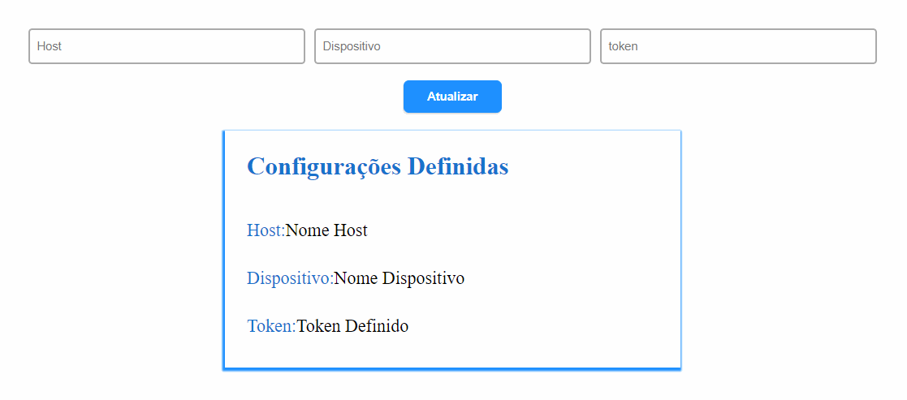

<p align="center">
  <a href="#Consumindo-API-no-FrontEnd">API FrontEnd</a>&nbsp;&nbsp;&nbsp;|&nbsp;&nbsp;&nbsp;
  <a href="#Consumindo-API-no-BackEnd">API BackEnd</a>&nbsp;&nbsp;&nbsp;|&nbsp;&nbsp;&nbsp;
  <a href="#DOM-Events">DOM Events</a>
</p>

## Consumindo API no FrontEnd

```javascript
async function getContent() {
  const url = "https://jsonplaceholder.typicode.com/users";

  try {
    const response = await fetch(url);
    const data = await response.json();
    console.log(data);

  } catch (error) {
    console.log(error);
  }
}
```
<br>

## Consumindo API no BackEnd

```javascript
const cors = require("cors");
const express = require("express");
const axios = require("axios");
const app = express();
const port = 3000;

app.use(cors());

app.get("/", async (req, res) => {
  const URL = "https://jsonplaceholder.typicode.com/users";

  try {
    // {data} -> pego só dados da requisição
    const {data} = await axios(URL); 
    console.log(data);
    // return res.json(data);
  
  } catch (error) {
      console.error(error);
  }
});

app.listen(port, () => {
  console.log(`Example app listening at http://localhost:${port}`);
});

```
<br>

## DOM events

<div align=center>
    
</div>
